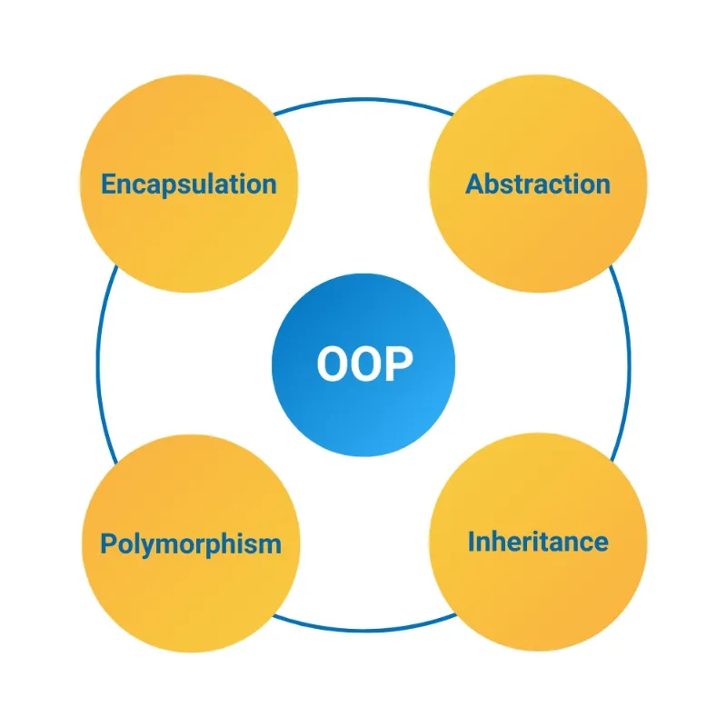
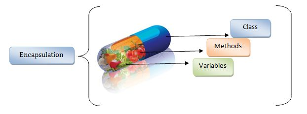
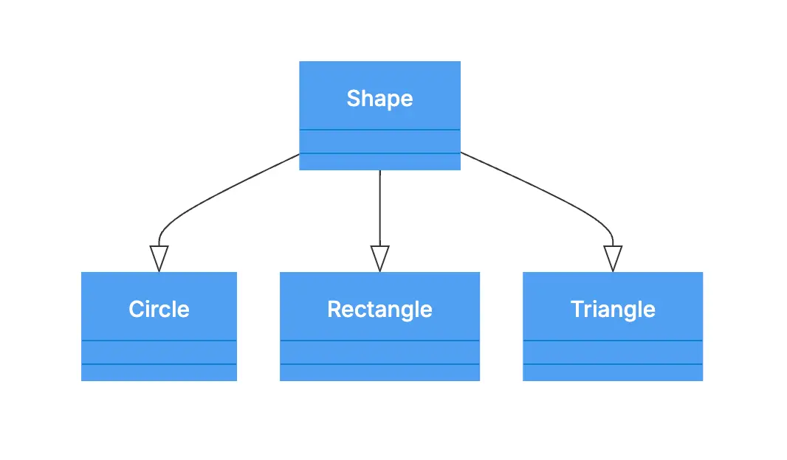
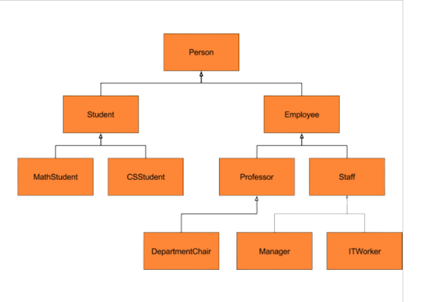
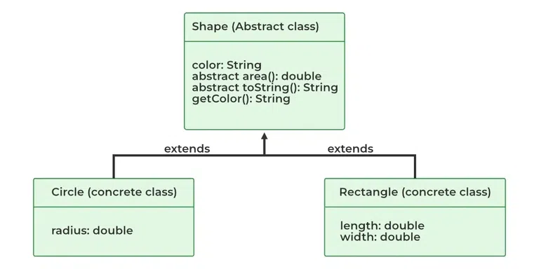

<!-- Header -->
- title: "What is OOP? Mastering the 4 Core Principles of Object-Oriented Programming"
- datetime: 2026-04-29 00:00
- author: "Konnn04 and Internet"
- keywords: ["OOP", "Object-Oriented Programming", "Encapsulation", "Inheritance", "Polymorphism", "Abstraction", "Coding Fundamentals"]
- description: "An in-depth guide to Object-Oriented Programming (OOP). Master the 4 core principles to write clean, scalable code and ace your technical interviews."
- image: "assets/oop-core-principles-guide.png"
- categories: ["Programming", "Computer Science", "Interview Prep"]
<!-- Content -->
# Object-Oriented Programming (OOP) and Its Core Principles

## Introduction

If you're a computer science student or preparing for technical interviews, you've likely come across **Object-Oriented Programming (OOP)**. It is one of the most essential programming paradigms used in modern software development.

But what exactly is OOP? Why is it so important? And what are its core principles?

This article will guide you through everything you need to know, from basic concepts to practical examples.

<!-- keyword: oop concept diagram, object oriented programming illustration -->


---

## What is OOP?

Object-Oriented Programming (OOP) is a programming paradigm based on the concept of **objects**.

Each object contains:

* **Attributes** (data)
* **Methods** (behavior)

**Example:**
A "Student" object may have:

* Attributes: name, age, student ID
* Methods: study(), takeExam(), enroll()

---

## The 4 Core Principles of OOP

### 1. Encapsulation

Encapsulation means **hiding internal data** and only exposing controlled access through methods.

**Benefits:**

* Data protection
* Better control over changes
* Improved code maintainability

**Example:**

```java
class Student {
    private String name;

    public String getName() {
        return name;
    }

    public void setName(String name) {
        this.name = name;
    }
}
```

<!-- keyword: encapsulation diagram oop -->


---

### 2. Inheritance

Inheritance allows a class to **reuse properties and behaviors of another class**.

**Benefits:**

* Code reusability
* Reduced duplication
* Easier scalability

**Example:**

```java
class Animal {
    void eat() {
        System.out.println("Eating...");
    }
}

class Dog extends Animal {
    void bark() {
        System.out.println("Barking...");
    }
}
```

<!-- keyword: inheritance diagram oop -->


---

### 3. Polymorphism

Polymorphism allows a method to **behave differently depending on the context**.

**Types:**

* Method Overloading
* Method Overriding

**Example:**

```java
class Animal {
    void sound() {
        System.out.println("Animal sound");
    }
}

class Dog extends Animal {
    void sound() {
        System.out.println("Dog barks");
    }
}
```

<!-- keyword: polymorphism oop example diagram -->


---

### 4. Abstraction

Abstraction means **hiding complex implementation details** and showing only essential features.

**Benefits:**

* Reduces complexity
* Focuses on high-level design

**Example:**

```java
abstract class Animal {
    abstract void sound();
}
```

<!-- keyword: abstraction oop diagram -->

---

## Quick Comparison

| Principle     | Purpose             |
| ------------- | ------------------- |
| Encapsulation | Data protection     |
| Inheritance   | Code reuse          |
| Polymorphism  | Flexible behavior   |
| Abstraction   | Simplify complexity |

---

## When Should You Use OOP?

OOP is especially useful when:

* Building large-scale systems
* Working in teams
* Developing maintainable applications

---

## Interview Tips for OOP

If you're preparing for interviews:

* Clearly understand all 4 principles
* Know the difference between:

  * Overloading vs Overriding
  * Abstract Class vs Interface
* Be ready to explain with real-world examples

---

## Conclusion

OOP is more than just a concept—it's a powerful tool that helps you write clean, scalable, and maintainable code.

Mastering its four core principles will help you:

* Improve coding skills
* Build better software
* Perform confidently in interviews

👉 Have you encountered OOP questions in interviews?
