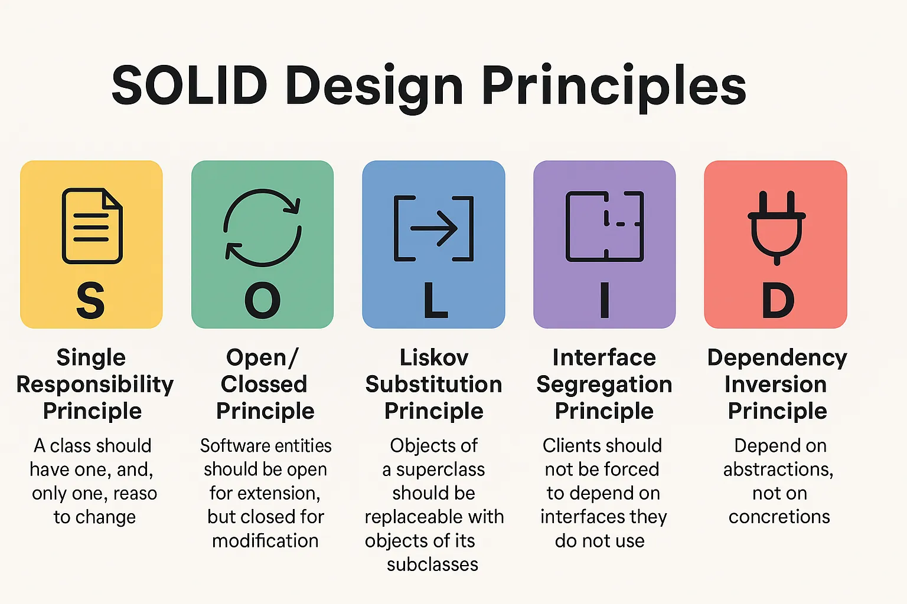
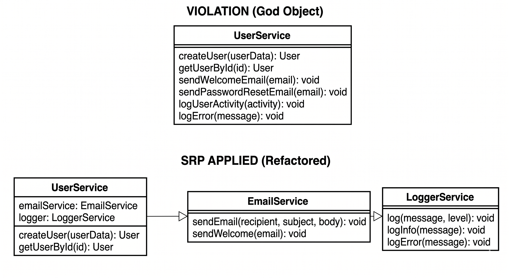
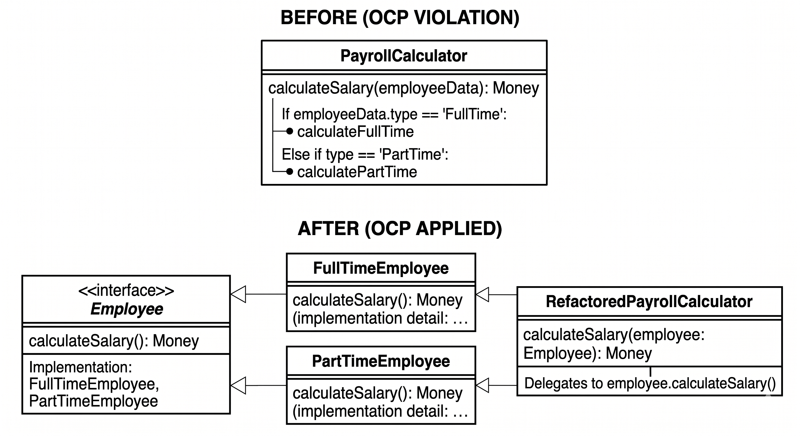
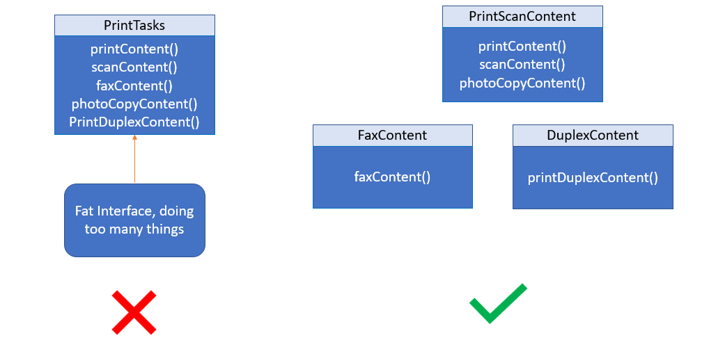

<!-- Header -->
- title: "What is SOLID? The Golden Key to System Design for Developers"
- datetime: 2026-04-28 00:00
- author: "Konnn04, and Online source"
- keywords: ["SOLID principles", "Clean Code", "System Design", "OOP", "Software Architecture", "Programming for Students"]
- description: "Unlock the 5 SOLID principles to elevate your system design skills. A must-read guide for students and developers to write professional, maintainable code."
- image: "assets/solid-principles-visual-guide.png"
- categories: ["Programming", "Software Design", "Career Advice"]
<!-- Content -->
# What is SOLID? The Golden Key to System Design for Developers

Hi everyone, I'm Trieu. In your journey of learning IT, you've probably heard terms like "Clean Code" or "System Design." One of the most important foundations for achieving those is **SOLID**.

Whether you're a junior student struggling with projects or preparing for an upcoming internship, mastering SOLID will not only help you write "pro" code but also serve as a huge plus in the eyes of recruiters. Let's decode these 5 principles in detail!

---

## 1. S - Single Responsibility Principle (SRP)

### Definition
A class (or module) should have one, and only one, reason to change.

### Why does it matter?
Imagine a Swiss Army knife: bottle opener, paper cutter, screwdriver. If the blade breaks, you have to replace or repair the whole set. In programming, if a class does too many things (a "God Object"), changing one piece of logic might accidentally break another.

### Real-world Example (TypeScript)
Instead of a `UserService` that handles user logic, sends emails, and logs data to a file:
- **Bad:** `UserService` does everything.
- **Good:** Split it into `UserService`, `EmailService`, and `LoggerService`.

> **Interview Tip:** When asked about SRP, emphasize **maintainability** and **testability**.

---

## 2. O - Open/Closed Principle (OCP)

### Definition
Software entities (classes, modules, functions) should be **open for extension**, but **closed for modification**.

### Explanation
You shouldn't have to modify existing, stable code every time a new requirement comes in. Instead, write new code based on the old foundation (through inheritance or interfaces).

<!-- [Image keyword: Open Closed Principle strategy pattern diagram] -->

### Example
If you have a payroll module for `FullTimeEmployee`, and you need to add `PartTimeEmployee`, don't use `if-else` in the old function. Create an `Employee` interface and let subclasses implement their own salary calculation logic.

---

## 3. L - Liskov Substitution Principle (LSP)

### Definition
Objects of a superclass should be replaceable with objects of its subclasses without affecting the correctness of the program.

### Common Misconception
Students often think, "If Child inherits from Parent, it can obviously replace it." But it's not that simple.
- **Classic Example:** "A bird can fly." An ostrich is a bird, but an ostrich... cannot fly. If `Ostrich` inherits `Bird` and you call `fly()`, the program crashes or behaves unexpectedly.

### Solution
Use better class hierarchies or prefer Composition over Inheritance.

---

## 4. I - Interface Segregation Principle (ISP)

### Definition
No client should be forced to depend on methods it does not use. Split large interfaces into smaller, more specific ones.

<!-- [Image keyword: Interface Segregation Principle before after diagram] -->

### Practical Connection
In a NestJS or Next.js project, if you create a `RepositoryInterface` with 20 methods, but a subclass only needs 2, that's a violation of ISP. Split them into `Readable`, `Writable`, and `Deletable` interfaces.

---

## 5. Dependency Inversion Principle (DIP)

### Definition
1. High-level modules should not depend on low-level modules. Both should depend on abstractions.
2. Abstractions should not depend on details. Details should depend on abstractions.

### Application
This is the foundation of **Dependency Injection (DI)** seen in NestJS or Angular.
- Instead of a `Controller` directly instantiating a `MySQLDatabase`, have the `Controller` accept a `DatabaseInterface`. Want to switch to MongoDB later? Just swap the implementation class without touching the `Controller`.

---

## Conclusion and Advice for Students

Mastering SOLID isn't something that happens overnight. You need to practice, "break and rebuild" your code many times to truly internalize it.

**Quick Summary for Interviews:**
- **S:** Single responsibility.
- **O:** Extend, don't modify.
- **L:** Child can replace Parent.
- **I:** Small, concise interfaces.
- **D:** Depend on interfaces/abstractions.

Are you applying any of these principles in your projects? Which one do you find the most confusing?